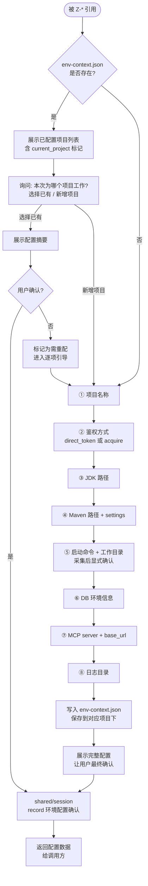

# Z-Powers V3 Enhancements Implementation Plan

> **For agentic workers:** REQUIRED SUB-SKILL: Use subagent-driven-development (recommended) or executing-plans to implement this plan task-by-task. Steps use checkbox (`- [ ]`) syntax for tracking.

**Goal:** Implement 3 enhancements to Z-Powers shared/ skills: spec/plan brainstorm pre-stage, env-context multi-project structure, session full conversation log.

**Architecture:** All changes are in `z-powers/skills/shared/` layer. No changes to tester/ skills. Each shared skill gets updated independently. The spec design doc at `docs/superpowers/specs/2026-05-09-z-powers-v3-enhancements-design.md` contains full design details.

**Tech Stack:** Markdown SKILL.md files following Z-Powers conventions (HARD-GATE, uses:, mermaid diagrams, checklist, output contract sections).

---

### Task 1: shared/spec — Add brainstorm pre-stage

**Files:**
- Modify: `z-powers/skills/shared/spec/SKILL.md`

- [ ] **Step 1: Add `uses: shared/brainstorm` to collaboration section**

In `z-powers/skills/shared/spec/SKILL.md`, find the existing collaboration section (currently has no `uses:` block since spec only references session indirectly). Add:

```markdown
## 协作关系

```
uses:
  shared/brainstorm  → 编写前澄清 spec scope 和结构偏好
  shared/session     → 记录确认结果
```
```

- [ ] **Step 2: Update flow to include brainstorm pre-stage**

Replace the current flow section with one that includes a brainstorm stage before writing:

```markdown
## 流程

1. **前置 brainstorm**：调用 `shared/brainstorm`，注入上下文：
   - "本次要编写一份设计文档，输入是已确认的设计方案"
   - shared/brainstorm 按通用流程执行：逐轮提问 → 2-3 方案 → 用户确认
2. **编写文档**：基于确认结果，按规范结构编写 spec.md，保存到调用方指定路径
3. **自检**：
   - 占位符扫描：是否有 TBD、TODO、不完整章节？
   - 内部一致性：架构是否与功能描述矛盾？
   - 范围检查：聚焦于单个 plan 可完成的范围？
   - 歧义检查：是否有两种解读方式的模糊需求？
4. **用户审阅**：展示完整文档
5. **用户确认**：确认后记录 session
6. **下一步**：由调用方决定（典型场景下调用 shared/plan）
```

- [ ] **Step 3: Update the HARD-GATE to cover brainstorm**

Make sure the HARD-GATE reflects that brainstorm confirmation is also required:

```markdown
<HARD-GATE>
未经用户确认 spec 结构方案（brainstorm 输出），不得进入编写阶段。
未经用户确认 spec 内容，不得进入 plan 编写阶段。
自检未通过的 spec 不得提交用户审阅。
</HARD-GATE>
```

- [ ] **Step 4: Verify the complete file reads coherently**

Read the final file and check:
- The brainstorm pre-stage is clearly described as "调用 shared/brainstorm"
- The output contract still references session correctly
- No conflicting statements with existing content

---

### Task 2: shared/plan — Add brainstorm pre-stage

**Files:**
- Modify: `z-powers/skills/shared/plan/SKILL.md`

- [ ] **Step 1: Add `uses: shared/brainstorm` to collaboration section**

Add a new collaboration section at the top (after the description, before flow):

```markdown
## 协作关系

```
uses:
  shared/brainstorm  → 编写前澄清执行策略和分解方式
  shared/session     → 记录确认结果
```
```

- [ ] **Step 2: Update flow to include brainstorm pre-stage**

Replace the current flow:

```markdown
## 流程

1. **前置 brainstorm**：调用 `shared/brainstorm`，注入上下文：
   - "本次要将已确认的 spec 分解为可执行的计划"
   - shared/brainstorm 按通用流程执行：逐轮提问 → 2-3 方案 → 用户确认
2. **文件结构先行**：列出所有需要创建/修改的文件及其职责
3. **分解任务**：每步 2-5 分钟，独立可执行
4. **编写计划文档**：按规范结构编写 plan.md，保存到调用方指定路径
5. **自检**：
   - Spec 覆盖率：每个 spec 需求是否有对应任务？
   - 占位符扫描：是否有 TBD、TODO、"类似任务 N"？
   - 类型一致性：任务间函数签名、类型、属性名是否一致？
6. **用户确认**：确认后记录 session
7. **输出**：将 plan.md 路径返回调用方，由调用方决定下一步
```

- [ ] **Step 3: Update HARD-GATE**

```markdown
<HARD-GATE>
未经用户确认执行策略（brainstorm 输出），不得进入分解阶段。
未经用户确认 plan，不得交付。
含占位符的 plan 不得提交用户审阅。
</HARD-GATE>
```

- [ ] **Step 4: Verify the complete file reads coherently**

Read the final file and check for consistency.

---

### Task 3: shared/env-config — Multi-project structure + auth + start command confirmation

**Files:**
- Modify: `z-powers/skills/shared/env-config/SKILL.md`

- [ ] **Step 1: Update the flow diagram**

Replace the mermaid flow diagram with the new multi-project flow:

```markdown


- [ ] **Step 2: Update the configuration items table**

Replace the existing table with the new one:

```markdown
| 顺序 | 配置项 | 引导词 | 约束 |
|------|--------|--------|------|
| ① | 项目名称 | "请给这个项目一个简短名称（如 my-app）？" | 唯一标识 |
| ② | 鉴权 | "鉴权 token 提供方式：直接给 token (direct_token)，还是描述获取方式 (acquire)？" | direct_token 时存储值；acquire 时存储获取描述 |
| ③ | JDK 路径 | "项目使用的 JDK 安装路径是？" | 确认路径存在 |
| ④ | Maven 路径 | "Maven 安装目录和 settings.xml 文件路径是？" | 确认路径存在 |
| ⑤ | 启动命令 | "项目的完整启动命令是什么？工作目录在哪？" | **采集后显式确认**："是这个命令没错？"用户必须确认 |
| ⑥ | DB MCP | "数据库环境名（如 dev/test）、host、port、库名、用户名？可配置多个环境。" | 禁止 root；密码不记录在此文件 |
| ⑦ | HTTP MCP | "本地 HTTP 服务的 base_url、端口和对应的 MCP server 名是？" | 确认端口可访问 |
| ⑧ | 日志目录 | "项目运行时日志输出到哪个目录？" | 确认目录存在 |
```

- [ ] **Step 3: Update the JSON format example**

Replace with the new multi-project structure:

````markdown
```json
{
  "version": 2,
  "updated_at": "2026-05-09 10:00",
  "current_project": "my-app",
  "projects": {
    "my-app": {
      "auth": {
        "method": "direct_token",
        "token": "eyJhbGciOiJIUzI1NiIs...",
        "acquire": null,
        "acquire_credentials": null
      },
      "build": {
        "jdk_home": "C:/Program Files/Java/jdk-17",
        "maven_home": "C:/tools/maven",
        "maven_settings": "C:/Users/xxx/.m2/settings.xml"
      },
      "run": {
        "jdk_home": "C:/Program Files/Java/jdk-17",
        "start_command": "mvn spring-boot:run",
        "project_dir": "E:/project/my-app"
      },
      "db": {
        "environments": [
          {
            "name": "dev",
            "host": "localhost",
            "port": 3306,
            "database": "myapp_dev",
            "username": "app_user",
            "constraints": ["禁止使用 root 账号"]
          }
        ]
      },
      "mcp_servers": {
        "db_mcp": "dev-db-mcp",
        "http_mcp": "local-http-mcp",
        "base_url": "http://localhost:8080"
      },
      "logs": {
        "directory": "E:/project/my-app/logs"
      }
    }
  }
}
```
````

- [ ] **Step 4: Update description to mention multi-project**

Update the opening description to reflect multi-project support:

```markdown
# shared/env-config — 运行时环境上下文管理

管理 `.zion-powers/env-context.json` 的全生命周期。支持多独立项目配置，每个项目包含鉴权、编译、启动、数据库等配置。
在 executor 执行前确保环境就绪。被 `tester/execute` 及未来 Z-* execute 阶段通过 `uses:` 引用。
```

- [ ] **Step 5: Verify the complete file**

Read the final file and verify:
- Flow diagram matches the new multi-project flow
- Auth collection is included
- Start command confirmation is mentioned
- JSON example matches the new structure

---

### Task 4: shared/session — Add conversation log support

**Files:**
- Modify: `z-powers/skills/shared/session/SKILL.md`

- [ ] **Step 1: Add `对话` phase to the record table**

In the `记录时机与内容` table, add the new `对话` phase:

```markdown
| 时机 | phase 值 | 记录内容 |
|------|----------|----------|
| 每次 AI 输出 + 用户回复后 | `对话` | ai_msg、user_msg、时间戳 |
| 任务开始 | `任务开始` | 功能名称、用户原始输入、时间戳 |
| 设计方案确认 | `设计确认` | 方案概要、用户确认意见 |
| env 配置确认 | `环境配置确认` | 配置项摘要、环境列表 |
| Spec 确认 | `Spec 确认` | spec.md 路径、确认时间 |
| Plan 确认 | `Plan 确认` | plan.md 路径、任务总数 |
| 执行完成 | `执行完成` | 通过/失败统计、报告路径 |
```

- [ ] **Step 2: Add conversation log format to `条目格式` section**

Add the conversation entry format after the existing format description:

```markdown
### 对话条目格式

对话条目记录每个 AI↔User 的交互来回：

```markdown
### [2026-05-09 10:01] 对话
**AI→User**
逐轮提问澄清测试范围：你希望覆盖哪些场景？

**User→AI**
正常登录、密码错误、账号锁定三种
```

格式规范：
- H3 标题 `### [时间戳] 对话`
- 对话内容使用 `**AI→User**` 和 `**User→AI**` 标记方向
- AI 消息和用户消息之间空一行
- 紧跟在当前阶段标题之后
```

- [ ] **Step 3: Add session file structure overview**

Add a section showing the full session file structure with both dialogue and stage records:

```markdown
## 文件结构示例

```markdown
# 任务会话日志
- 功能：测试登录接口
- 任务目录：`.zion-powers/tester/2026-05-09_login/session.md`
- 开始时间：2026-05-09 10:00

### [2026-05-09 10:01] 对话
**AI→User**
你希望覆盖哪些场景？

**User→AI**
正常登录、密码错误、账号锁定

### [2026-05-09 10:02] 对话
**AI→User**
账号锁定期望行为？

**User→AI**
5次错误锁定30分钟

## [2026-05-09 10:05] 设计确认
- 方案：正常/异常/锁定三种场景
- 用户确认：同意

### [2026-05-09 10:06] 对话
**AI→User**
现在开始编写 spec？
```
```

- [ ] **Step 4: Verify the complete file**

Read the final file and verify:
- record API supports `"对话"` phase
- Dialogue format is clearly specified
- Examples show both H2 (stage) and H3 (dialogue) entries
- No conflict with existing get() query logic
