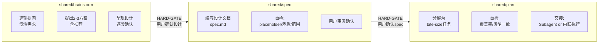
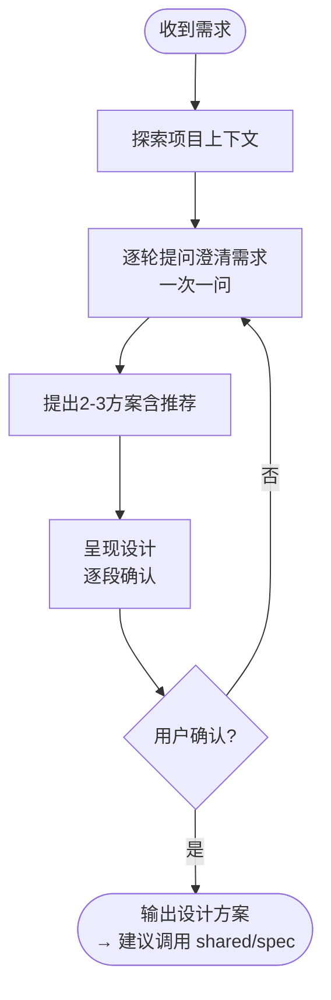
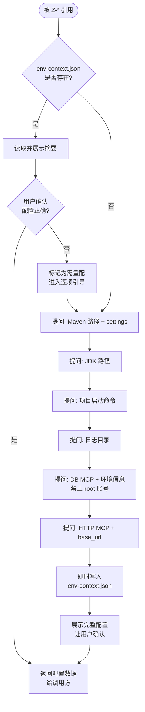
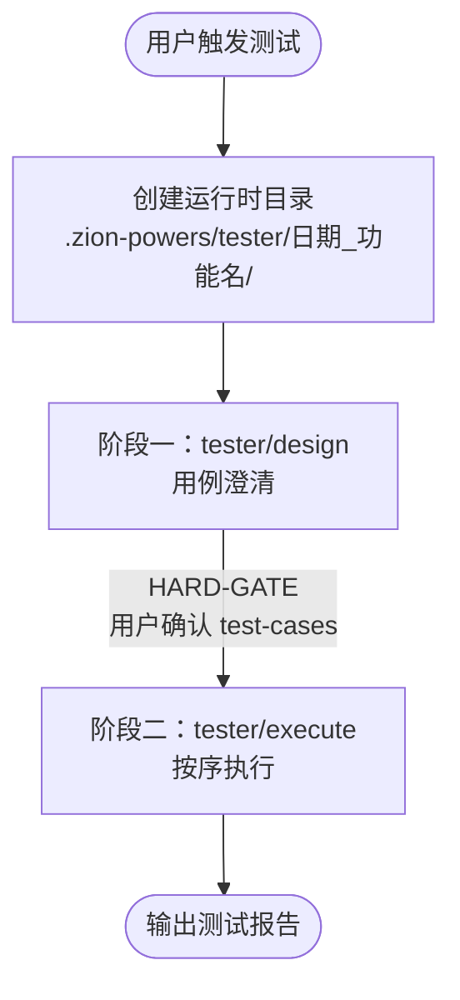
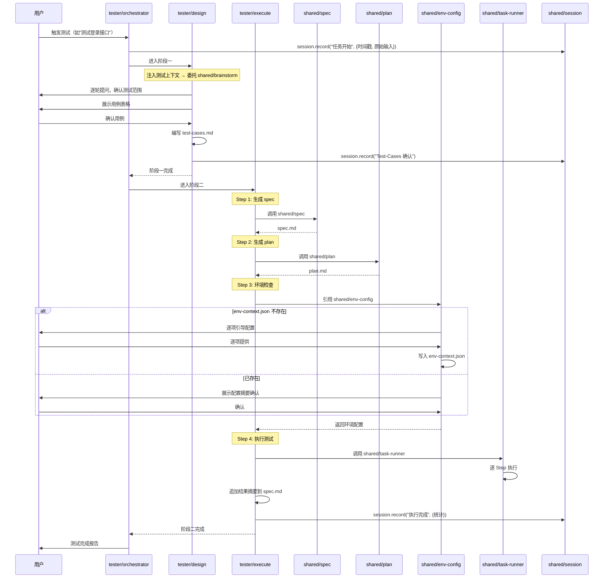

# Z-Powers 技能包设计文档

# 1. 版本历史

| 版本 | 作者 | 日期 | 描述 |
|------|------|------|------|
| V1 | superpowers | 2026-05-07 | 初始版本：Z-Tester 四阶段门禁工作流设计 |
| V2 | superpowers | 2026-05-07 | 重构：抽取 shared/ 通用流程层，Z-Tester 通过薄封装复用 shared pipeline |
| V4 | superpowers | 2026-05-08 | 改造：tester 从三阶段改为两阶段（Design → Execute），Design 产出 test-cases.md，Execute 按 4 步执行 |

---

# 2. 目标

**目标**：基于 Superpowers 的设计思想，构建 Z-Powers AI 技能包。抽取通用流程层（brainstorm → spec → plan）到 `shared/`，供 Z-Tester 及未来 Z-* 技能复用。第一阶段实现 Z-Tester，为 Java + Spring Boot 项目提供两阶段门禁的 HTTP 接口测试工作流（Design → Execute）。

**设计原则**：
- 借鉴 Superpowers 的 brainstorming 逐轮提问模式，但抽取为通用 shared skill
- 借鉴 Superpowers 的 `<HARD-GATE>` 硬门禁机制，每个阶段确认不可跳过
- 遵循 Superpowers SKILL.md 的 `uses:` 引用约定，实现 skill 间解耦
- 通用流程层保持领域无关，领域特定上下文由各 Z-* 薄封装层注入

---

# 3. 架构总览

## 3.1 四层架构

```
Plugin Layer      .claude-plugin/ / .codex-plugin/ / .cursor-plugin/
                       │
Shared Layer        shared/ (通用流程层)
    brainstorm ──→ spec ──→ plan
      (需求澄清     (设计文档     (执行计划
       方案设计)     编写确认)     编写+交接)
                       │
Domain Layer        tester/ (测试领域层)
   design ──→ execute
   (用例澄清)  (spec→plan→env→run)
                       │
Runtime Layer    .zion-powers/ (运行时产物：env-context.json + 各 Z-* 产物目录)
```

## 3.2 Skill 引用关系

```
Z-Tester Orchestrator (入口 skill)
  uses:
    ├── tester/design      → 注入测试上下文，委托 shared/brainstorm + shared/spec
    ├── tester/plan        → 注入测试分解模板，委托 shared/plan
    ├── tester/execute     → 执行前先引用 shared/env-config
    └── shared/session     → 会话记录 (贯穿全部阶段)

tester/design
  uses:
    ├── shared/brainstorm  → 通用需求澄清 + 方案设计流程
    ├── shared/spec        → 通用设计文档编写流程
    └── shared/session     → 记录确认结果

tester/plan
  uses:
    ├── shared/plan        → 通用执行计划编写流程
    └── shared/session     → 记录确认结果

tester/execute
  uses:
    ├── shared/env-config  → 执行前获取 MCP/Maven/JVM/日志配置
    └── shared/session     → 记录执行结果
```

---

# 4. 目录结构

## 4.1 插件目录

```
Z-Powers/
├── requirement.md
├── design.md                          ← 本文档
├── README.md                          # 安装使用说明
├── .claude-plugin/
│   └── plugin.json
├── .codex-plugin/
│   └── plugin.json
├── .cursor-plugin/
│   └── plugin.json
└── skills/
    ├── shared/
    │   ├── brainstorm/SKILL.md        # 通用：需求澄清 + 方案设计
    │   ├── env-config/SKILL.md        # 通用：运行时环境上下文管理（MCP/Maven/JVM/日志）
    │   ├── plan/SKILL.md              # 通用：执行计划编写 + 执行交接
    │   ├── session/SKILL.md           # 通用：会话管理
    │   └── spec/SKILL.md              # 通用：设计文档编写 + 用户确认
    ├── tester/
        ├── orchestrator/SKILL.md      # 编排四阶段，注入测试上下文
        ├── design/SKILL.md            # 薄封装：注入测试用例领域上下文
        ├── plan/SKILL.md              # 薄封装：注入测试任务分解模板
        └── execute/SKILL.md           # 执行：测试执行逻辑
    └── templates/
        ├── brainstorm-question.md
        ├── test-cases.md
        ├── spec.md
        ├── plan.md
        └── session-entry.md
```

## 4.2 运行时目录

```
用户项目/
└── .zion-powers/
    ├── env-context.json           # ★ 运行时环境上下文（MCP/Maven/JVM/日志配置）
    └── tester/
        └── 2026-05-07_login-function/
            ├── session.md
            ├── spec.md
            └── plan.md
```

---

# 5. Shared 通用流程层设计

## 5.1 三阶段 Pipeline



| Skill | 输入 | 产出 | 门禁 |
|-------|------|------|------|
| brainstorm | 用户需求 | 经用户确认的设计方案 | 确认后进入 spec |
| spec | 设计构思 | spec.md + 用户确认 | 确认后进入 plan |
| plan | spec.md | plan.md + 执行交接 | 确认后执行 |

## 5.2 shared/brainstorm — 需求澄清与方案设计

### 来源
从 Superpowers brainstorming 抽取，去除视觉伴侣和 git 管理。

### 流程



### Checklist

1. **探索项目上下文** — 检查文件、文档、项目结构
2. **逐轮提问澄清需求** — 一次一问，优先选择题，理解目的/约束/成功标准
3. **提出 2-3 种方案** — 含推荐和取舍分析
4. **逐段呈现设计** — 复杂段落分别确认，不一次性全部展示
5. **用户确认设计方案** — 确认后才可进入下一阶段

### HARD-GATE

```
<HARD-GATE>
未经用户确认设计方案，不得进入 spec 编写阶段。
</HARD-GATE>
```

### 反模式：「太简单不用设计」

任何项目都经过此流程。简单项目设计可以很短（几句话），但必须呈现并获得确认。

### 关键原则

- **一次一问** — 不一次抛出多个问题
- **选择题优先** — 比开放题更容易回答
- **YAGNI 无情** — 从所有设计中移除不必要的功能
- **探索替代方案** — 在定案前始终提出 2-3 种方案
- **增量验证** — 逐段呈现设计，确认后再继续

### 裁剪说明

| 移除项 | 原因 |
|--------|------|
| Visual Companion 整节与脚本 | 不需要浏览器展示 mockup 的能力 |
| visual-companion.md 引用 | 同上 |
| git commit 步骤 | Z-Powers 不要求自动 git 管理 |
| 默认保存路径 | 改为 Z-Powers 约定（由调用方 spec 确定） |

## 5.3 shared/spec — 设计文档编写

### 概述

从 Superpowers brainstorming 第 6 步独立出来的 skill。输入经 brainstorm 确认的设计构思，输出规范的设计文档，经用户确认后传递到 plan 阶段。

### 流程

1. **输入**：经 brainstorm 确认的设计方案（包含架构、组件、数据流等）
2. **编写设计文档**：按照规范结构编写 spec.md
3. **自检**：
   - 占位符扫描：是否有 TBD、TODO、不完整章节？
   - 内部一致性：架构描述是否与功能描述矛盾？
   - 范围检查：是否聚焦于单个 plan 可完成的范围？
   - 歧义检查：是否有两种解读方式的模糊需求？
4. **用户审阅**：展示完整文档给用户
5. **用户确认**：确认后输出 spec.md
6. **下一步**：建议用户调用 shared/plan

### HARD-GATE

```
<HARD-GATE>
未经用户确认 spec，不得进入 plan 编写阶段。
自检未通过的 spec 不得提交用户审阅。
</HARD-GATE>
```

### Spec 文档结构

```markdown
# [功能名称] - 设计文档

## 1. 目标
## 2. 架构
### 2.1 组件
### 2.2 数据流
## 3. 详细设计
## 4. 错误处理
## 5. 测试策略
## 6. 未完成事项
```

（具体结构由调用方通过上下文定制，此为通用模板。）

## 5.4 shared/plan — 执行计划编写

### 来源
从 Superpowers writing-plans 抽取，去除 git commit 步骤。

### 流程

1. **输入**：经确认的 spec.md
2. **文件结构先行**：列出所有需要创建/修改的文件及其职责
3. **分解任务**：将实现分解为 bite-size 任务（每步 2-5 分钟）
4. **编写计划文档**：按规范结构编写 plan.md
5. **自检**：
   - Spec 覆盖率：每个 spec 需求是否有对应任务？
   - 占位符扫描：是否有 TBD、TODO、"类似任务 N"？
   - 类型一致性：任务间的函数签名、类型、属性名是否一致？
6. **用户确认 plan**
7. **执行交接**：提供两种执行方式供用户选择

### 任务粒度

每个步骤是一个可独立执行的动作（2-5 分钟）：
- "编写失败测试" — 步骤
- "运行确认失败" — 步骤
- "编写最小实现" — 步骤
- "运行确认通过" — 步骤

### 无占位符

以下均为 plan 的失败模式：
- "添加适当的错误处理"（没有具体错误处理代码）
- "类似任务 N"（重复完整代码）
- "编写测试验证以上功能"（没有具体测试代码）

### 执行交接

Plan 编写完成后，提供两种执行方式：
1. **Subagent 驱动（推荐）** — 每个任务派发独立子代理，任务间审查
2. **内联执行** — 在当前会话中按序执行，批处理 + 检查点

### HARD-GATE

```
<HARD-GATE>
未经用户确认 plan，不得进入执行阶段。
含占位符的 plan 不得提交用户审阅。
</HARD-GATE>
```

### Plan 文档结构

```markdown
# [功能名称] Implementation Plan

> **For agentic workers:** REQUIRED SUB-SKILL: Use subagent-driven-development or executing-plans.

**Goal:** [一句话]

**Architecture:** [2-3 句]

**Tech Stack:** [关键技术栈]

---

### Task N: [组件名]

**Files:**
- Create: `path/to/file`
- Modify: `path/to/file:123-145`
- Test: `tests/path/to/test.py`

- [ ] **Step 1: 编写失败测试**
  ```代码```
- [ ] **Step 2: 运行确认失败**
- [ ] **Step 3: 最小实现**
  ```代码```
- [ ] **Step 4: 运行确认通过**
```

## 5.5 shared/session — 会话管理

### 说明

沿用 V1 设计，被其他五个 skill 引用。通过增量追加方式写入 `session.md`。

### 接口契约

```
session.record(phase, content)
  - phase: 阶段标识（"任务开始" / "设计确认" / "Spec 确认" / "Plan 确认" / "执行完成"）
  - content: 记录内容（结构化数据）

session.get(phase)
  - 返回指定阶段的历史记录
```

### 记录时机与内容

| 时机 | 记录内容 |
|------|----------|
| 任务开始 | 功能名称、用户原始输入、时间戳 |
| 设计方案确认 | 方案概要、用户确认意见 |
| Spec 确认 | spec.md 路径、确认时间 |
| Plan 确认 | plan.md 路径、任务总数 |
| 执行完成 | 通过/失败统计、报告路径 |

### session.md 格式

```markdown
## [2026-05-07 10:30] 设计确认
- 用户输入：测试登录接口
- AI 执行：逐轮提问，确认测试范围
- 关键决策：专注正常/异常/锁定三种场景
- 下一步：等待用户确认设计方案

## [2026-05-07 10:35] Spec 确认
- spec.md 已确认
- 下一步：编写执行计划
```

## 5.6 shared/env-config — 运行时环境上下文管理

### 概述

独立 skill，管理 `.zion-powers/env-context.json` 的全生命周期。被 `tester/execute` 及未来 Z-* 技能通过 `uses:` 引用，在 execute 阶段前完成环境就绪。

### 协作关系

```
uses:
  shared/brainstorm  → 逐项澄清缺失的配置（一次一问）
  shared/session     → 记录配置确认时间点
```

### 流程



### 逐项配置说明

每次提问一个主题，不一次性抛出所有问题。每完成一项即时写入文件，防止断点丢失。

| 配置项 | 引导问题示例 | 约束 |
|--------|-------------|------|
| Maven 路径 | "Maven 安装路径和 settings.xml 文件在哪？" | 确认路径存在 |
| JDK 路径 | "项目使用的 JDK 路径是？" | 确认路径存在 |
| 编译命令 | "项目的完整编译命令是什么？（如 `mvn spring-boot:run`）" | 含工作目录 |
| 启动命令 | "编译产物的启动命令？（如 `java -jar`）" | 自动追加日志重定向 |
| 日志目录 | "项目运行时日志输出到哪个目录？" | 确认目录存在 |
| DB MCP + 环境 | "提供环境名、MCP server 名、数据库 host/port/库名/用户。每个环境独立配置。" | 禁止 root；密码不记录在此文件 |
| HTTP MCP | "本地 HTTP 服务的 base_url 和端口是？使用的 MCP server 名是？" | 确认端口可访问 |

### env-context.json 格式

```json
{
  "version": 1,
  "updated_at": "",
  "build": {
    "command": "mvn clean package -DskipTests",
    "project_dir": "E:/project/my-app"
  },
  "run": {
    "command": "java -jar target/my-app-1.0.0.jar",
    "project_dir": "E:/project/my-app",
    "log_file": ".zion-powers/tester/2026-05-09_login/log/app.log"
  },
  "mcp_servers": {
    "db": {
      "environments": [
        {
          "name": "dev",
          "mcp_server_name": "",
          "db_type": "",
          "host": "",
          "port": 3306,
          "database": "",
          "username": "",
          "constraints": ["禁止使用 root 账号"]
        }
      ]
    },
    "http": {
      "mcp_server_name": "",
      "base_url": "",
      "port": 8080
    }
  },
  "logs": {
    "directory": ""
  }
}
```

### HARD-GATE

```
<HARD-GATE>
未经环境配置确认，tester/execute 不得开始执行测试任务。
env-context.json 缺失或关键字段为空时，必须通过 shared/env-config 的逐项引导完成配置。
</HARD-GATE>
```

---

# 6. Z-Tester 领域层设计

## 6.1 两阶段门禁流程



## 6.2 编排时序



## 6.3 tester/orchestrator — 调度器

### 职责
- 编排两阶段（Design → Execute）
- 强制执行门禁机制
- 创建运行时目录 `.zion-powers/tester/[yyyy-MM-dd]_[功能名]/`
- 不包含任何业务逻辑

### HARD-GATE

```
<HARD-GATE>
Design 阶段完成后必须等待用户确认 test-cases，禁止跳过门禁进入 Execute 阶段。
确认结果必须写入 session 记录，否则视为门禁未通过。
</HARD-GATE>
```

## 6.4 tester/design — 用例澄清

### 职责
不包含通用流程逻辑，核心工作是**注入测试领域上下文**后委托 shared skill，产出 test-cases.md。

1. 接收 orchestrator 的测试请求
2. 注入领域上下文到 shared/brainstorm：
   - "本次编写 HTTP 接口测试用例"
   - 确认事项：接口地址、请求方法、参数、预期状态码
3. 委托 shared/brainstorm 执行通用流程（逐轮提问 → 方案 → 确认）
4. 收到确认后，编写 test-cases.md
5. 结果回 orchestrator

### 协作关系

```
uses:
  shared/brainstorm  → 逐轮提问 + 方案设计
  shared/session     → 确认记录
```

## 6.5 tester/execute — 测试执行

### 职责
按 4 步顺序执行测试，每步调用 shared skill 完成。

### 协作关系

```
uses:
  shared/spec        → Step 1：生成 spec.md
  shared/plan        → Step 2：生成 plan.md
  shared/env-config  → Step 3：环境检查
  shared/task-runner → Step 4：执行测试
  shared/session     → 记录执行结果
```

### 流程

1. **Step 1**：调用 shared/spec，输入 test-cases.md，产出 spec.md（协作锚点）
2. **Step 2**：调用 shared/plan，输入 test-cases.md，产出 plan.md
3. **Step 3**：调用 shared/env-config 确认环境就绪
4. **Step 4**：调用 shared/task-runner，传入 plan.md，逐 Step 执行
5. 追加结果摘要到 spec.md

### 失败处理策略

| 失败类型 | 行为 | 自动重试 |
|----------|------|----------|
| 测试代码（数据准备） | 修复后重试 1 次 | 是 |
| 测试代码（断言） | 修复后重试 1 次 | 是 |
| 业务代码（接口返回非预期） | 分析根因，暂停报告 | 否 |

### 进度持久化
每次任务更新后写入 `plan.md`（覆盖 `[ ]` → `[✓]` / `[✗]`）。

---

# 7. 核心约束

## 铁律

1. **禁止跳过门禁**：每个阶段产出必须经过用户确认，不得进入下一阶段
2. **禁止全量扫描代码**：只读取用户指定的需求/设计文档或 Controller 类
3. **失败快速反馈**：尝试 1 次失败后立即向用户反馈，不重复尝试
4. **确认必记录**：每个确认点必须有 session 记录，否则视为门禁未通过
5. **shared 层保持领域无关**：不包含任何测试/特定领域的逻辑
6. **薄封装层不重复通用流程**：只注入领域上下文，不重新实现思考流程
7. **一次失败即反馈**：模型在尝试解决问题（编译失败、接口不通、数据错误等）时，只允许重试 1 次。若第 1 次修复后仍未解决，立即停下来向用户报告根因和上下文，由用户决定下一步

## 门禁速查

| 阶段 | 产出 | 确认点 | 确认后才能进入 |
|------|------|--------|---------------|
| 用例澄清 | test-cases.md | 用户确认 test-cases | Execute |
| 执行 | 执行结果 | 执行完成报告 | 完成 |

## shared vs domain 职责边界

| 能力 | 归属 | 原因 |
|------|------|------|
| 逐轮提问澄清需求 | shared/brainstorm | 与领域无关的通用对话模式 |
| 提出 2-3 种方案 | shared/brainstorm | 与领域无关的决策方法 |
| 编写协作锚点文档 | shared/spec | 与领域无关的文档规范 |
| 自检 placeholder/矛盾 | shared/spec | 与领域无关的质量检查 |
| 分解 bite-size 任务 | shared/plan | 与领域无关的任务规划 |
| 管理运行时环境上下文 | shared/env-config | 与领域无关的环境配置管理 |
| 管理执行循环和进度 | shared/task-runner | 与领域无关的执行流程管理 |
| 测试用例表格 | tester/design（注入） | 测试领域特有格式 |
| 测试执行编排（spec→plan→env→run） | tester/execute | 测试领域特有执行顺序 |
