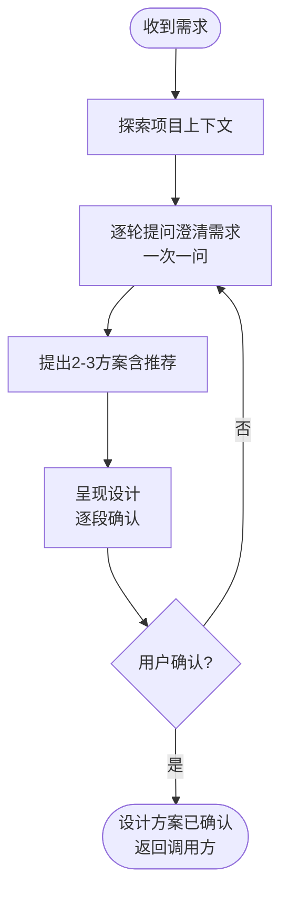

# shared/brainstorm — 需求澄清与方案设计

将模糊需求转化为经用户确认的设计方案。通过逐轮提问澄清需求，提出 2-3 种方案并推荐，逐段呈现设计后输出确认结果。

<HARD-GATE>
未经用户确认设计方案，不得进入下一阶段。
</HARD-GATE>

## 反模式：「太简单不用设计」

任何项目都经过此流程。简单项目设计可以很短（几句话），但必须呈现并获得确认。简单项目正是未经验证的假设造成最多返工的地方。

## Checklist

按顺序逐项完成以下任务：

1. **探索项目上下文** — 检查文件、文档、项目结构
2. **逐轮提问澄清需求** — 一次一问，优先选择题，理解目的/约束/成功标准
3. **提出 2-3 种方案** — 含推荐和取舍分析
4. **逐段呈现设计** — 复杂段落分别确认，不一次性全部展示
5. **用户确认设计方案** — 确认后才可进入下一阶段

## 流程

## The Process

### 理解需求

- 先探索当前项目状态（文件、文档、项目结构）
- 在提问前评估范围：如果需求包含多个独立子系统（如"构建一个平台，包含聊天、存储、计费和分析"），立即指出。不要在需要拆分的项目上花时间细化细节
- 如果项目太大不适合单个 spec，帮助用户拆分为子项目：独立模块是什么，它们之间如何关联，构建顺序是什么？然后针对第一个子项目执行 brainstorm 流程。每个子项目有独立的 spec → plan → 执行周期
- 对适当范围的项目，一次问一个问题来细化需求
- 优先使用选择题，开放题也可以
- 每条消息只问一个问题——如果一个主题需要深入探讨，拆分为多个问题
- 聚焦于理解：目的、约束、成功标准

### 探索方案

- 提出 2-3 种不同的方案，含取舍分析
- 以对话方式呈现选项，附带推荐和理由
- 用推荐方案开头，解释为什么推荐

### 呈现设计

- 确定理解要构建什么后，呈现设计
- 每节内容控制在合适的复杂度：简单则几句话，复杂则 200-300 字
- 每节之后询问"这部分是否合适"
- 覆盖：架构、组件、数据流、错误处理、测试
- 随时准备回溯澄清

### 在现有代码库中工作

- 先探索当前结构再提议变更。遵循已有模式
- 现有代码影响工作时（如文件过大、边界不清、职责纠缠），将针对性改进纳入设计
- 不提议无关的重构。聚焦于当前目标

### 设计原则：隔离与清晰

- 将系统分解为更小的单元，每个有单一清晰职责，通过定义良好的接口通信，可独立理解和测试
- 对每个单元应能回答：它做什么，如何使用，依赖什么
- 能否不看内部实现就能理解一个单元的功能？能否在不破坏调用方的情况下修改内部实现？如果不能，边界需要调整
- 更小、边界清晰的单元也更容易工作——你能更好地在上下文中理解代码，聚焦的文件也让编辑更可靠。文件变得过大时，通常表明它在做太多事情

## 关键原则

- **一次一问** — 不一次抛出多个问题
- **选择题优先** — 比开放题更容易回答
- **YAGNI 无情** — 从所有设计中移除不必要的功能
- **探索替代方案** — 在定案前始终提出 2-3 种方案
- **增量验证** — 逐段呈现设计，确认后再继续
- **灵活调整** — 遇到不合理时回溯澄清

## 输出契约

本 skill 完成后的产出：

1. **设计方案** — 经用户确认的设计方案（内容由调用方确定具体格式）
2. **session 记录** — 调用 `shared/session.record("设计确认", {方案概要, 用户意见})`

## 后续流程

本 skill **不指定**下一步做什么。调用方决定后续流程：

| 调用方 | 后续动作 |
|--------|----------|
| `tester/design` | 确认后调用 `shared/spec` 编写设计文档 |
| `shared/env-config` | 确认后将配置写入 `env-context.json` |
| 其他 Z-* | 由调用方自行编排 |

brainstorm 只负责"把模糊需求澄清为经用户确认的设计方案"，之后做什么是调用方的职责。
