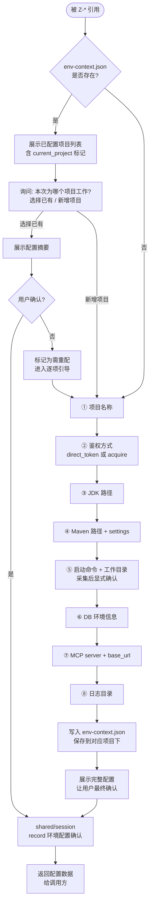

# shared/env-config — 运行时环境上下文管理

管理 `.zion-powers/env-context.json` 的全生命周期。支持多独立项目配置，每个项目包含鉴权、编译、启动、数据库等配置。
在 executor 执行前确保环境就绪。被 `tester/execute` 及未来 Z-* execute 阶段通过 `uses:` 引用。

## 协作关系

```
uses:
  shared/session     → 记录配置确认结果
```

注意：配置项均为**事实性采集**（路径在哪里、端口是什么），非设计探索，不调用 shared/brainstorm。但遵循相同的"一次一问"原则。

## 流程



## 配置项明细

每轮只问一个问题。用户回答后即时写入文件，防止断点丢失。

| 顺序 | 配置项 | 引导词 | 约束 |
|------|--------|--------|------|
| ① | 项目名称 | "请给这个项目一个简短名称（如 my-app）？" | 唯一标识 |
| ② | 鉴权 | "鉴权 token 提供方式：直接给 token (direct_token)，还是描述获取方式 (acquire)？" | direct_token 时存储值；acquire 时存储获取描述+凭据 |
| ③ | JDK 路径 | "项目使用的 JDK 安装路径是？" | 确认路径存在 |
| ④ | Maven 路径 | "Maven 安装目录和 settings.xml 文件路径是？" | 确认路径存在 |
| ⑤ | 启动命令 | "项目的完整启动命令是什么？工作目录在哪？" | **采集后显式确认**："是这个命令没错？"用户必须确认 |
| ⑥ | DB 信息 | "数据库环境名（如 dev/test）、host、port、库名、用户名？可配置多个环境。" | 禁止 root；密码不记录在此文件 |
| ⑦ | MCP server | "本地 HTTP 服务的 base_url、端口和对应的 MCP server 名是？" | 确认端口可访问 |
| ⑧ | 日志目录 | "项目运行时日志输出到哪个目录？" | 确认目录存在 |

## 文件格式

```json
{
  "version": 2,
  "updated_at": "2026-05-09 10:00",
  "current_project": "my-app",
  "projects": {
    "my-app": {
      "auth": {
        "method": "direct_token",
        "token": "eyJhbGciOiJIUzI1NiIs...",
        "acquire": null,
        "acquire_credentials": null
      },
      "build": {
        "jdk_home": "C:/Program Files/Java/jdk-17",
        "maven_home": "C:/tools/maven",
        "maven_settings": "C:/Users/xxx/.m2/settings.xml"
      },
      "run": {
        "jdk_home": "C:/Program Files/Java/jdk-17",
        "start_command": "mvn spring-boot:run",
        "project_dir": "E:/project/my-app"
      },
      "db": {
        "environments": [
          {
            "name": "dev",
            "host": "localhost",
            "port": 3306,
            "database": "myapp_dev",
            "username": "app_user",
            "constraints": ["禁止使用 root 账号"]
          }
        ]
      },
      "mcp_servers": {
        "db_mcp": "dev-db-mcp",
        "http_mcp": "local-http-mcp",
        "base_url": "http://localhost:8080"
      },
      "logs": {
        "directory": "E:/project/my-app/logs"
      }
    }
  }
}
```

## 输出契约

1. **env-context.json** — 写入 `.zion-powers/env-context.json`
2. **session 记录** — `shared/session.record("环境配置确认", {配置摘要, 环境列表})`
3. **返回数据** — 将完整配置对象返回给调用方

### 启动命令确认说明

启动命令采集后必须显式确认：
1. 回显完整命令 + 工作目录给用户
2. 用户必须明确回答"是，正确"
3. 未确认时，env-config 返回"启动命令未确认"状态给调用方

## 被调用方使用

调用方（如 `tester/execute`）在 execute 阶段开始时：

> 强制引用 `shared/env-config` 确认环境就绪，然后从返回的配置中提取 MCP/Maven/JVM/日志信息执行任务。

<HARD-GATE>
未经环境配置确认，tester/execute 不得开始执行测试任务。
env-context.json 缺失或关键字段为空时，必须通过 shared/env-config 的逐项引导完成配置。
</HARD-GATE>
