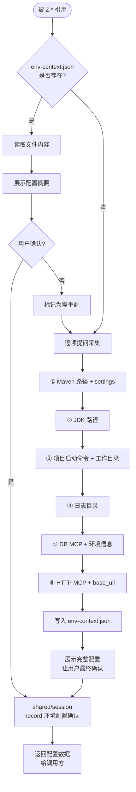

# shared/env-config — 运行时环境上下文管理

管理 `.zion-powers/env-context.json` 的全生命周期。在 executor 执行前确保环境就绪。被 `tester/execute` 及未来 Z-* execute 阶段通过 `uses:` 引用。

## 协作关系

```
uses:
  shared/session     → 记录配置确认结果
```

注意：配置项均为**事实性采集**（路径在哪里、端口是什么），非设计探索，不调用 shared/brainstorm。但遵循相同的"一次一问"原则。

## 流程



## 配置项明细

每轮只问一个问题。用户回答后即时写入文件，防止断点丢失。

| 顺序 | 配置项 | 引导词 | 约束 |
|------|--------|--------|------|
| ① | Maven 路径 | "Maven 安装目录和 settings.xml 文件路径是？" | 确认路径存在 |
| ② | JDK 路径 | "项目使用的 JDK 安装路径是？" | 确认路径存在 |
| ③ | 启动命令 | "项目的完整启动命令是什么？工作目录在哪？"（如 `mvn spring-boot:run`） | 含工作目录 |
| ④ | 日志目录 | "项目运行时日志输出到哪个目录？" | 确认目录存在 |
| ⑤ | DB MCP | "数据库环境名（如 dev/test）、MCP server 名、host、port、库名、用户名？可配置多个环境。" | 禁止 root；密码不记录在此文件 |
| ⑥ | HTTP MCP | "本地 HTTP 服务的 base_url、端口和对应的 MCP server 名是？" | 确认端口可访问 |

## 文件格式

```json
{
  "version": 1,
  "updated_at": "2026-05-07",
  "maven": {
    "home": "C:/tools/maven",
    "settings": "C:/Users/xxx/.m2/settings.xml"
  },
  "jvm": {
    "java_home": "C:/Program Files/Java/jdk-17",
    "start_command": "mvn spring-boot:run",
    "project_dir": "E:/project/my-app"
  },
  "mcp_servers": {
    "db": {
      "environments": [
        {
          "name": "dev",
          "mcp_server_name": "dev-db-mcp",
          "db_type": "mysql",
          "host": "localhost",
          "port": 3306,
          "database": "myapp_dev",
          "username": "app_user",
          "constraints": ["禁止使用 root 账号"]
        }
      ]
    },
    "http": {
      "mcp_server_name": "local-http-mcp",
      "base_url": "http://localhost",
      "port": 8080
    }
  },
  "logs": {
    "directory": "E:/project/my-app/logs"
  }
}
```

## 输出契约

1. **env-context.json** — 写入 `.zion-powers/env-context.json`
2. **session 记录** — `shared/session.record("环境配置确认", {配置摘要, 环境列表})`
3. **返回数据** — 将完整配置对象返回给调用方

## 被调用方使用

调用方（如 `tester/execute`）在 execute 阶段开始时：

> 强制引用 `shared/env-config` 确认环境就绪，然后从返回的配置中提取 MCP/Maven/JVM/日志信息执行任务。

<HARD-GATE>
未经环境配置确认，tester/execute 不得开始执行测试任务。
env-context.json 缺失或关键字段为空时，必须通过 shared/env-config 的逐项引导完成配置。
</HARD-GATE>
