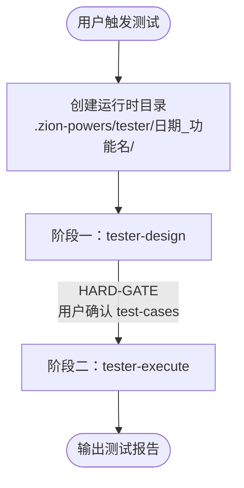

# tester/orchestrator — Z-Tester 调度器

编排 Z-Tester 两阶段流程（Design → Execute），强制执行门禁机制。作为用户触发测试的入口 skill，不包含任何业务逻辑。

## 协作关系

```
uses:
  ├── tester-design       → 阶段一：用例澄清，产出 test-cases.md
  ├── tester-execute      → 阶段二：按序执行 4 步（spec → plan → env-config → task-runner）
  └── shared/session      → 贯穿全部阶段
```

## 两阶段流程



## 流程说明

### 启动
1. 接收用户测试请求（如"测试登录接口"）
2. 创建运行时目录：`.zion-powers/tester/[yyyy-MM-dd]_[功能名]/`
3. `shared/session.record("任务开始", {功能名, 原始输入, 时间戳})`
4. 按阶段顺序执行

### 阶段一：委托 tester-design
- tester-design 注入测试上下文，委托 shared/brainstorm 澄清用例
- 产出 test-cases.md
- 等待 tester-design 返回
- 调用 shared/session.record("流程状态", {
    current_step: "design",
    pipeline: ["design", "spec", "plan", "env-config", "task-runner"],
    completed: <动态>根据当前完成情况填充,
    resume_context: "阶段一完成，test-cases.md 已产出"
  })

### HARD-GATE：test-cases 确认
- 确认 `shared/session.record("Test-Cases 确认")` 已写入
- 未通过不得进入阶段二

### 阶段二：委托 tester-execute
- 调用 shared/session.record("流程状态", {
    current_step: "spec",
    pipeline: ["design", "spec", "plan", "env-config", "task-runner"],
    completed: ["design"],
    resume_context: "准备进入阶段二：生成 spec"
  })
- tester-execute 按 4 步执行：生成 spec → 生成 plan → 环境检查 → 执行测试
- 等待 tester-execute 返回

### 完成
- 收集测试报告
- 向用户展示完成报告

<HARD-GATE>
Design 阶段完成后必须等待用户确认 test-cases，禁止跳过任何门禁进入 Execute 阶段。
确认结果必须写入 session 记录，否则视为门禁未通过。
</HARD-GATE>
