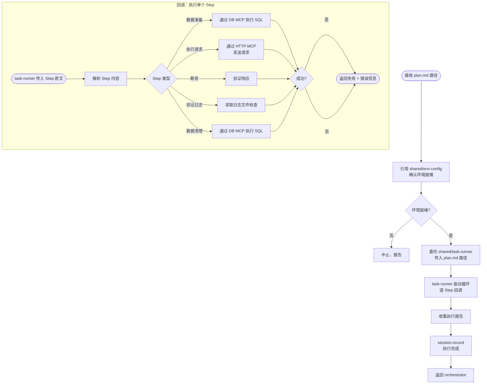

# tester/execute — 测试执行

领域层 executor。注入测试领域执行逻辑，委托 `shared/env-config` 确认环境，委托 `shared/task-runner` 管理执行流程。

## 协作关系

```
uses:
  shared/env-config    → 执行前获取 MCP/Maven/JVM/日志配置
  shared/task-runner   → 管理执行循环、进度、检查点
  shared/session       → 记录执行结果
```

## 流程



## 回调实现

shared/task-runner 驱动 Step 循环，对每个 Step 回调 tester/execute。回调的输入和输出：

**输入**：Step 原文（如 `1. 数据准备：INSERT INTO users ...`）

**输出**：成功 / 失败（含错误信息）

### Step 类型解析

根据 Step 描述的首个关键词判断类型：

| Step 关键词 | 类型 | 操作 |
|------------|------|------|
| 数据准备 | DB 操作 | 通过 DB MCP 执行 SQL 语句 |
| 执行请求 / POST / GET / PUT / DELETE | HTTP 请求 | 通过 HTTP MCP 发送请求到配置的 base_url |
| 断言 / 验证 | 响应验证 | 验证状态码、响应体、header |
| 验证日志 | 日志查询 | 读取配置的日志目录中的日志文件 |
| 数据清理 | DB 操作 | 通过 DB MCP 执行清理 SQL |

### 回调示例

```
task-runner → "1. 数据准备：INSERT INTO users (id, name) VALUES (1, 'test');"
tester/execute → 解析为 DB 操作 → 通过 DB MCP 执行 SQL
              → 成功 → 返回成功

task-runner → "2. 执行请求：POST /api/login，body: {\"username\":\"test\"}"
tester/execute → 解析为 HTTP 请求 → 通过 HTTP MCP 发送
              → 返回 200 → 返回成功

task-runner → "3. 断言：状态码应为 200，响应体应含 token 字段"
tester/execute → 验证上一步返回的响应 → 匹配 → 返回成功
```

## 重试策略

覆盖 shared/task-runner 默认重试策略（测试领域特有）：

| 失败类型 | 行为 |
|----------|------|
| 数据准备 SQL 执行失败 | 修复后重试 1 次 |
| HTTP 请求失败（网络/超时） | 不重试，暂停报告 |
| HTTP 返回非预期状态码 | 分析根因，暂停报告 |
| 断言不匹配 | 修复后重试 1 次 |
| 日志查询失败 | 不重试，暂停报告 |
| 数据清理 SQL 执行失败 | 不重试，暂停报告（手动清理） |
