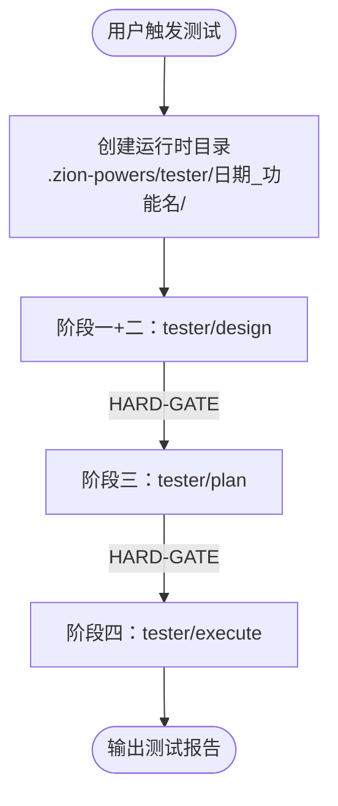

# tester/orchestrator — Z-Tester 调度器

编排 Z-Tester 四阶段流程，强制执行门禁机制。作为用户触发测试的入口 skill，不包含任何业务逻辑。

## 协作关系

```
uses:
  ├── tester/design       → 阶段一+二：用例澄清 + Spec 编写
  ├── tester/plan         → 阶段三：执行计划编写
  ├── tester/execute      → 阶段四：测试执行
  └── shared/session      → 贯穿全部阶段
```

## 四阶段流程



## 流程说明

### 启动
1. 接收用户测试请求（如"测试登录接口"）
2. 创建运行时目录：`.zion-powers/tester/[yyyy-MM-dd]_[功能名]/`
3. `shared/session.record("任务开始", {功能名, 原始输入, 时间戳})`
4. 按阶段顺序执行

### 阶段一+二：委托 tester/design
- tester/design 注入测试上下文，委托 shared/brainstorm + shared/spec
- 等待 tester/design 返回

### HARD-GATE：设计确认
- 确认 `shared/session.record("Spec 确认")` 已写入
- 未通过不得进入阶段三

### 阶段三：委托 tester/plan
- tester/plan 注入测试任务分解模板，委托 shared/plan
- 等待 tester/plan 返回

### HARD-GATE：Plan 确认
- 确认 `shared/session.record("Plan 确认")` 已写入
- 未通过不得进入阶段四

### 阶段四：委托 tester/execute
- tester/execute 执行测试，内部委托 shared/env-config + shared/task-runner
- 等待 tester/execute 返回

### 完成
- 收集测试报告
- 向用户展示完成报告

<HARD-GATE>
每个阶段完成后必须等待用户显式确认，禁止跳过任何门禁进入下一阶段。
任一阶段的确认结果必须写入 session 记录，否则视为门禁未通过。
</HARD-GATE>
